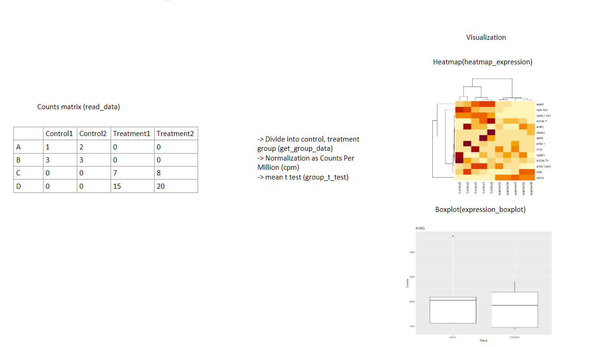

<!-- README.md is generated from README.Rmd. Please edit that file -->

# GeneDiffAnal

<!-- badges: start -->
<!-- badges: end -->

## Description

The purpose of this R package is to perform gene differential expression
analysis. RNA copy counts are the biological data being analyzed. This R
package adds gene differential expression analysis to a current work
flow in bioinformatics and computational biology. This R package
improves a current work flow in bioinformatics and computational biology
by better visualization of gene expression. R version 4.3.1 (2023-06-16
ucrt) and platform x86_64-w64-mingw32/x64 (64-bit) were used to develop
the package.

## Installation

To install the latest version of the package:

``` r
install.packages("devtools")
library("devtools")
devtools::install_github("jun-hyuk-park/GeneDiffAnal", build_vignettes = TRUE)
library("GeneDiffAnal")
```

To run the shinyApp: Under construction

## Overview

``` r
ls("package:GeneDiffAnal")
data(package = "GeneDiffAnal") # optional
browseVignettes("GeneDiffAnal")
```

- cpm

Convert A Matrix Of Given RNA Counts To A Matrix Of Counts Per Million.

- d

An arbitrary RNA counts data matrix included in this R package as an
example.

- expression_boxplot

Boxplots expression of each group of a gene.

- get_group_data

Filters RNA data of control or treatment group.

- group_t_test

Run Welch t test on gene expression of control group and treatment
group.

- heatmap_expression

Create a heatmap of expression of genes of samples in RNA level.

- fold_change

Calculate fold change of gene expression between control group and
treatment group.

<figure>

<figcaption aria-hidden="true">Overview</figcaption>
</figure>

## Contributions

The name of the author of the package is Jun Hyuk Park. I wrote all
codes in this R package as contribution. Generative AI was not used.

The stats R package is used for statistical test.

## References

R Core Team (2023). *R: A Language and Environment for Statistical
Computing*. R Foundation for Statistical Computing, Vienna, Austria.
<https://www.R-project.org/>.

Wickham, H. and Bryan, J. (2019). R Packages (2nd edition). Newton,
Massachusetts: O’Reilly Media. <https://r-pkgs.org/>

Koch CM, Chiu SF, Akbarpour M, Bharat A, Ridge KM, Bartom ET, Winter DR.
A Beginner’s Guide to Analysis of RNA Sequencing Data. Am J Respir Cell
Mol Biol. 2018. 59(2):145-157. doi: 10.1165/rcmb.2017-0430TR. PMID:
29624415; PMCID: PMC6096346.

B. L. WELCH. The generalization of student’s problem when several
different population variances are involved. Biometrika. 1947.
34(1-2):28-35.

## Acknowledgement

This package was developed as part of an assessment for 2023 BCB410H:
Applied Bioinformatics course at the University of Toronto, Toronto,
CANADA. GeneDiffAnal welcomes issues, enhancement requests, and other
contributions. To submit an issue, use the GitHub issues.

## Package Structure

``` r
- GeneDiffAnal
  |- TestingPackage.Rproj
  |- DESCRIPTION
  |- NAMESPACE
  |- LICENSE
  |- README
  |- data
    |- d.rda
  |- inst
    |- extdata
      |- d.csv
  |- man
    |- read_data.Rd
    |- group_t_test.Rd
    |- get_group_data.Rd
    |- d.Rd
    |- cpm.Rd
  |- R
    |- read_data.R
    |- group_t_test.R
    |- get_group_data.R
    |- data.R
    |- cpm.R
    |- heatmap_expression.R
    |- fold_change.R
  |- vignettes
    |- GeneDiffAnalVignettes.Rmd
  |- tests
    |- testthat.R
    |- testthat
      |- test-cpm.R
```
