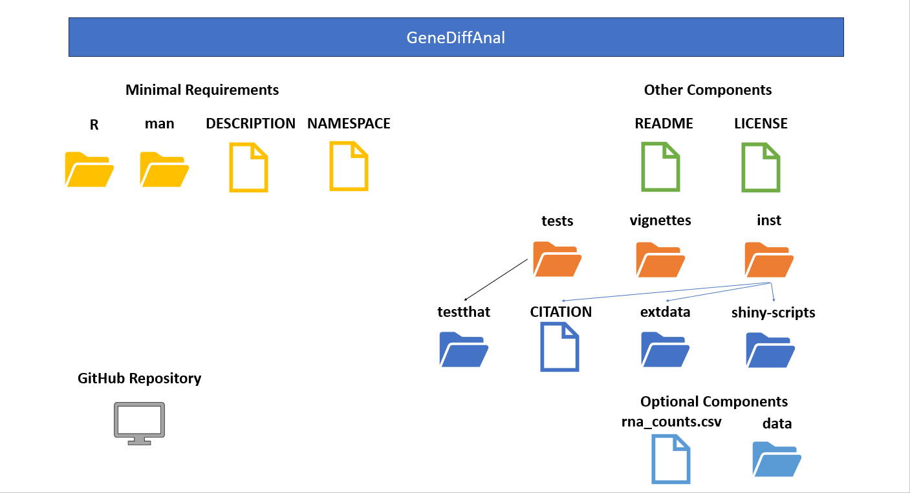

# GeneDiffAnal
       
## Introduction

`GeneDiffAnal` is a R package developed to perform differential gene expression
analysis. **This document gives a tour of GeneDiffAnal (version 0.1.0)**.
It was written in R Markdown, using the
[knitr](https://cran.r-project.org/package=knitr) package for production.
See `help(package = "GeneDiffAnal")` for further details. 

To download **GeneDiffAnal**, use the following commands:

``` r
require("devtools")
devtools::install_github("jun-hyuk-park/GeneDiffAnal", build_vignettes = TRUE)
library("GeneDiffAnal")
```

To list all sample functions available in the package:

``` r
ls("package:GeneDiffAnal")
```

To list all sample datasets available in the package:

``` r
data(package = "GeneDiffAnal")
```


## Components

The minimal requirements of GeneDiffAnal package. `rna_counts.csv` is 
optionally reuqired to run examples.

```{r, fig.cap="vignettes_img1", fig.align="center"}

```

### Minimal requirements

* **R subdirectory** within an R package contains all the R code files
or script files. These are files ending with ".R". 

* **man subdirectory** contains help documentation for each function that
is available to the user. *roxygen2* package is used to autogenerate Help files.

* **DESCRIPTION** file contains information about this package such as
metadata, including required packages, etc.

* **NAMESPACE** file provides a "context for looking up the value of an object
associated with a name". It was autogenerated by *roxygen2* package.

### Other

* **README** file mainly describes what the package does. It contains
description, installation, overview, contributions, references and
acknowledgements.

* **LICENSE** file describing who can use the R package. 

* The **data** subdirectory contains example data (.rd) for this package.

* The **tests** subdirectory includes the testthat subdirectory. It has tests
for functions of this package.

* The **vignettes** subdirectory includes this vignette file.

* The **inst** subdirectory contains other files and subdirectories.
**CITATION** file is here. The **shiny-scripts** subdirectory includes shiny
script file (app.R). The **extdata** subdirectory includes images included in README 
file.


## Applications

To perform gene differential analysis, you need RNA-seq count data. Such data
describes how many RNA reads in each sample overlaps a gene. A user needs to 
provide a table where columns are sample names and rows are gene names. And 
each cell represents the counts of RNA of the gene of that row and sample cell 
in that column.

```{r}
library(GeneDiffAnal)
knitr::kable(rna_counts, format = "html", caption = "rna_counts, Example of 
             RNA-seq count data included in this R package")
```

To load this data, you may use `read_data` function which is designed to 
streamline the process of reading RNA reads count data from a file and 
transforming it into a matrix. This function takes two parameters:

1. file_path: This is the path of the file containing RNA read counts data.

2. sep: This is an optional parameter that defines the separator character 
used in the file. The default is set to a comma, but users can specify a 
different character if their data file uses a different delimiter.

For example,

```{r}
rna_file <- system.file("extdata/rna_counts.csv", package="GeneDiffAnal")
read_data(rna_file)
```

The output of `read_data` on the example file is `rna_counts` which is 
included in this file as an example file.

The `cpm` function is designed to convert a matrix of RNA reads counts into a 
matrix of counts of per million (CPM). This conversion is particularly useful 
in normalizing RNA sequencing data, allowing for comparisons across different 
samples and genes. Such normalization provides a more accurate representation 
of biological signals, which improves the reliability of downstream statistical 
analyses (Koch et al. 2018).

This function takes a matrix as a parameter which expects a matrix of RNA reads 
counts as input. It returns a new matrix, where each entry corresponds to the 
counts per million of genes and samples.

## Package References

- Park, J. (2023) GeneDiffAnal. Unpublished.
https://github.com/jun-hyuk-park/GeneDiffAnal

## Other References


```{r}
sessionInfo()
```

